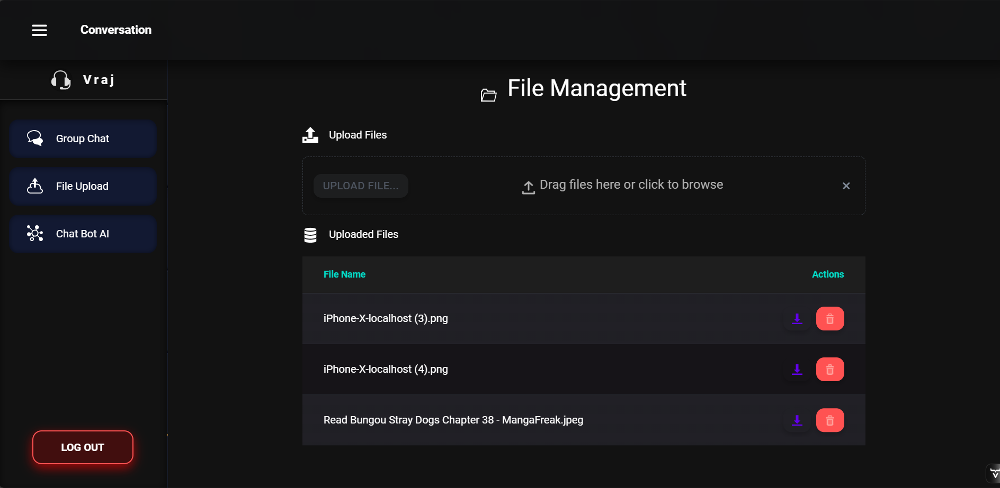
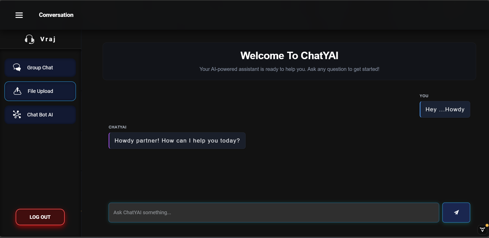
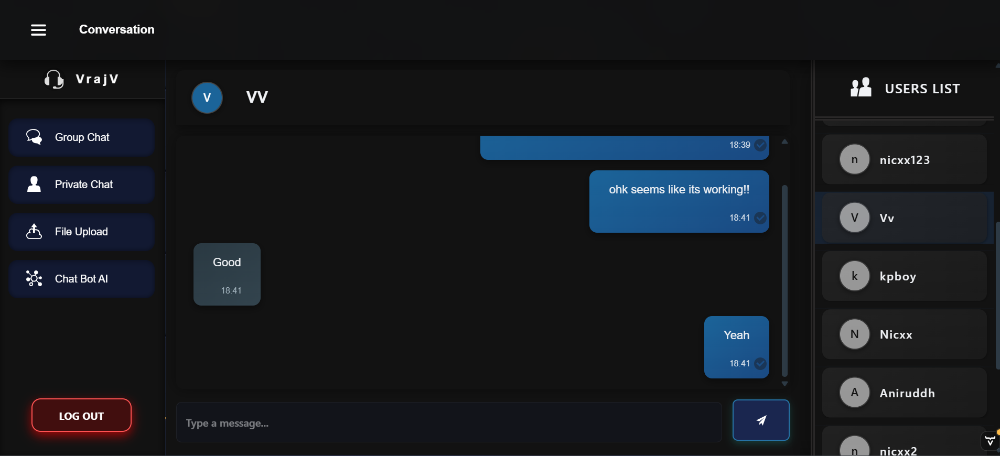
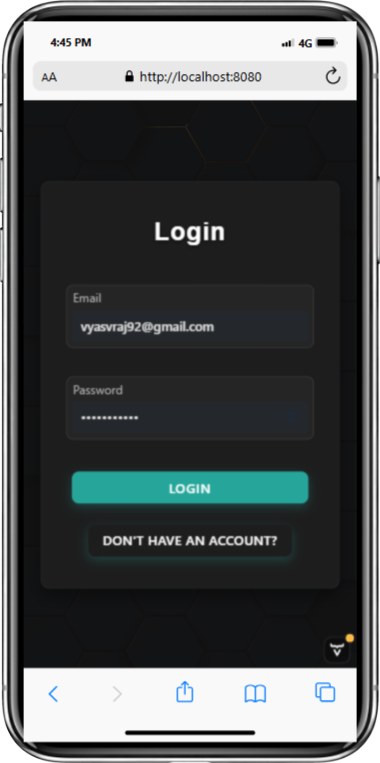
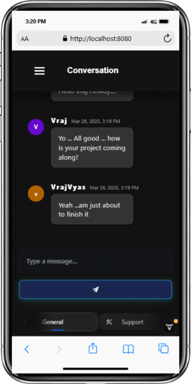
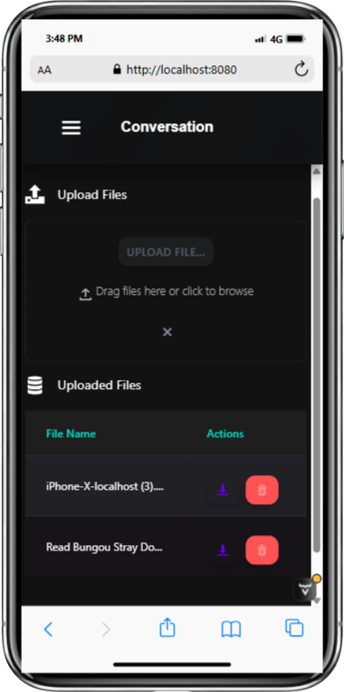

# Vaadin Chat Application

### 🚀Live Link : [https://vaadin-chat-app.onrender.com/login](https://vaadin-chat-app.onrender.com/login)

## Overview
This is a modern, feature-rich chat application built with Vaadin, offering seamless group and personal chats, file sharing, and AI-powered conversations using Google's Gemini model. It features a sleek, user-friendly design, secure JWT-based authentication, and real-time functionality powered by Supabase as the backend.

## Features
- **Group Chat**: Create and join group conversations for team collaboration.
- **Personal Chat**: Engage in private, one-on-one chats with other users.
- **File Sharing**: Share files directly within chats for easy collaboration.
- **AI Chat with Gemini**: Interact with Google's Gemini AI for assistance, answers, or casual conversation.
- **Secure Authentication**: JWT-based login ensures user security and session management.
- **Responsive Design**: Clean, modern UI optimized for desktop and mobile devices.
- **Real-Time Updates**: Supabase powers real-time chat updates and notifications.

## Live Images
Check out the app in action:

<table>
  <tr>
    <td></td>
    <td></td>
  </tr>
  <tr>
    <td></td>
    <td></td>
  </tr>
  <tr>
    <td></td>
    <td></td>
  </tr>
  <tr>
    <td></td>
  </tr>
</table>

<table>
  <tr>
    <td></td>
    <td></td>
    <td></td>
    <td></td>
    <td></td>
    <td></td>
  </tr>
</table>

## Technologies Used
- **Frontend**: Vaadin (for UI components and framework), JavaScript, HTML, CSS
- **Backend**: Supabase (for real-time database, authentication, and storage)
- **Authentication**: JSON Web Tokens (JWT) for secure user login
- **AI**: Google Gemini API for AI-powered chat functionality
- **Build Tool**: Apache Maven
- **Runtime**: Java (JDK)
- **Node.js**: For additional frontend dependencies
- **Deployment**: Render (for hosting the live application)

## Prerequisites
Before running the application locally, ensure you have the following installed and verified:

- **Java**: Check version by running `java -version` in your terminal. Requires JDK 17 or higher.
- **Maven**: Check version by running `mvn -version`. Ensure Maven is installed and configured.
- **Node.js**: Check version by running `node -v`. Required for frontend dependencies.
- **Supabase Account**: For backend services (real-time database, authentication, storage).
- **Google Cloud Credentials**: For Gemini API access.
- **Git**: For version control.

## Installation
Follow these steps to set up and install the Vaadin chat application:

### Step 1: Download and Install Java
Ensure Java Development Kit (JDK) 17 or higher is installed. Verify with:
```bash
java -version
```

### Step 2: Download and Install Maven
1. Visit the [Maven Download page](https://maven.apache.org/download.cgi).
2. Download the binary zip archive (e.g., `apache-maven-x.x.x-bin.zip`).
3. Extract the archive to a directory (e.g., `C:\Program Files\apache-maven\apache-maven-3.8.8`).

#### Configure Maven Environment Variables
1. Press `Win + R`, type `sysdm.cpl`, and press **Enter**.
2. In the System Properties window, go to the Advanced tab and click **Environment Variables**.
3. Under System Variables, click **New** and add:
   - Variable Name: `MAVEN_HOME`
   - Variable Value: `C:\Program Files\apache-maven\apache-maven-3.8.8`
4. Update the `Path` Variable:
   - Find the `Path` variable, select it, and click **Edit**.
   - Click **New** and add: `C:\Program Files\apache-maven\apache-maven-3.8.8\bin`
5. Save changes by clicking **OK** in all windows.

#### Verify Maven Installation
Open a new terminal or Command Prompt and run:
```bash
mvn -version
```
You should see output like:
```
Apache Maven 3.8.8 (...)
Java version: 17.0.11, vendor: Microsoft, runtime: C:\Program Files\Java\jdk-17.0.11
```

### Step 3: Clone the Repository
Clone the project to your local machine:
```bash
git clone <repository-url>
cd vaadin-chat-app
```

### Step 4: Set Up Environment Variables
Create a `.env` file in the root directory and add:
```
SUPABASE_URL=your_supabase_url
SUPABASE_KEY=your_supabase_key
GEMINI_API_KEY=your_gemini_api_key
JWT_SECRET=your_jwt_secret
```

### Step 5: Install Dependencies
No additional npm install is required for Vaadin, but ensure Maven dependencies are handled via the project’s `pom.xml`.

## Usage
To run the application locally:

1. Navigate to your Vaadin project directory:
   ```bash
   cd D:\Vaadin
   ```

2. Clean and build the project:
   ```bash
   mvn clean install
   ```

3. Run the Vaadin application:
   ```bash
   mvn spring-boot:run
   ```

4. Open your browser and go to:
   ```
   http://localhost:8080
   ```

Once running, log in using JWT credentials, and use the app for chatting, file sharing, and AI interactions.

## Deployment
The application is deployed on Render. To deploy your own instance:
1. Push your code to a Git repository.
2. Set up Render with the same environment variables as above.
3. Configure build command: `mvn clean install` and start command: `mvn spring-boot:run`.

## Contributing
We welcome contributions! Fork the repository, make your changes, and submit a pull request. Please ensure your code follows our coding standards and includes tests.

## License
This project is licensed under the MIT License. See the `LICENSE` file for details.


### Notes on Changes
- **Prerequisites**: Added specific checks for Java, Maven, and Node.js versions.
- **Installation**: Included detailed steps for downloading and configuring Maven, as per your provided instructions, and clarified that Node.js is needed for any frontend dependencies.
- **Usage**: Updated run commands to use `mvn spring-boot:run` and added `mvn clean install` for building, matching your provided steps.
- **No npm Install**: Removed `npm install` since Vaadin projects typically rely on Maven for dependencies, but kept Node.js as a prerequisite in case of frontend scripts.
